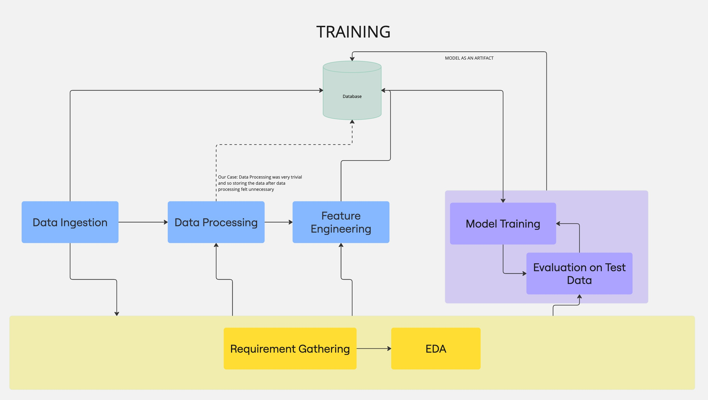

# Loan Lending Defaulter Detection

## Overview
This project aims to build a predictive model to detect loan defaulters for Lending Club. The dataset has been extracted from [Kaggle](https://www.kaggle.com/datasets/wordsforthewise/lending-club), and various data science techniques have been applied to develop a robust solution for identifying high-risk borrowers.

## Project Objectives
- Analyze Lending Club's loan dataset to understand key factors influencing loan defaults.
- Perform data preprocessing, feature engineering, and exploratory data analysis (EDA).
- Train and evaluate machine learning models to predict loan defaulters.
- Provide insights and recommendations based on model results.

## Dataset
The dataset consists of loan applications from Lending Club, including information on loan amount, interest rates, borrower income, credit history, employment details, and repayment status.

### Key Features:
- **loan_amnt**: The amount of the loan applied for.
- **int_rate**: Interest rate charged on the loan.
- **annual_inc**: Annual income of the borrower.
- **emp_length**: Length of employment in years.
- **dti**: Debt-to-income ratio.
- **fico_range_high**: FICO credit score range.
- **loan_status**: Indicates whether the borrower has defaulted or repaid the loan.

## Project Workflow

### 1. Data Preprocessing
- Handling missing values and outliers.
- Encoding categorical variables.
- Scaling numerical features.

### 2. Exploratory Data Analysis (EDA)
- Understanding distributions of key financial variables.
- Identifying correlations between features and loan defaults.
- Visualizing trends in borrower credit behavior.

### 3. Model Development
- Training machine learning models including:
  - Logistic Regression
  - K-Nearest Neighbours
  - Naive Bayes
  - Decision Trees
  - Bagging (Random Forest)
  - Gradient Boosting (XGBoost)
- Hyperparameter tuning using GridSearchCV.
- Model evaluation using metrics like accuracy, precision, recall, and F1-score.

### 4. Model Deployment
- Saving the feature engineering artefacts
- Saving the best model using Pickle or joblib.
- Creating a Gradio app for real-time predictions.

## Results and Findings
- Identified key factors affecting loan defaults, such as credit score, debt-to-income ratio, and employment history.
- Achieved high predictive accuracy with boosting algorithms.
- Provided recommendations for risk mitigation based on model insights.

## Installation & Usage
1. Clone the repository:
   ```sh
   git clone https://github.com/Kritika-19/loan-lending.git
   cd loan-lending
   ```
2. Install dependencies:
   ```sh
   pip install -r requirements.txt
   ```

## Technologies Used
- Python
- Pandas, NumPy
- Scikit-Learn
- XGBoost
- Matplotlib, Seaborn
- Gradio (for deployment)

## Contributors
- **Kritika-19** ([GitHub Profile](https://github.com/Kritika-19))

## License
This project is licensed under the MIT License.

## Acknowledgments
- [Kaggle Lending Club Dataset](https://www.kaggle.com/datasets/wordsforthewise/lending-club)
- Open-source contributors for data science tools and frameworks.